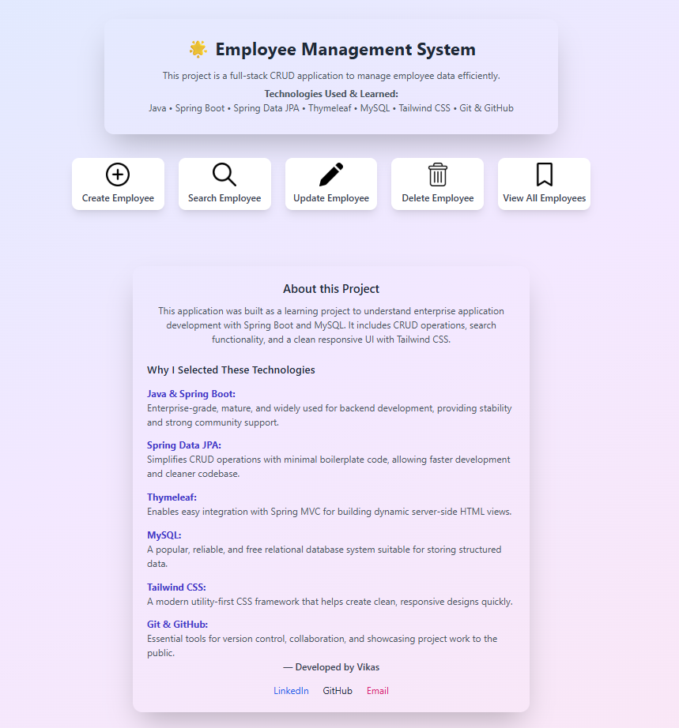
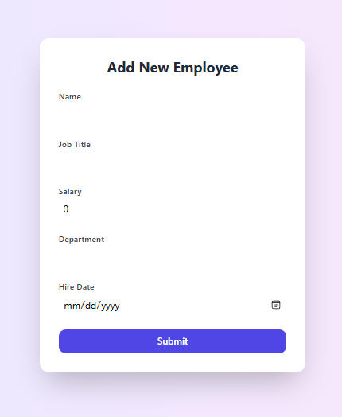
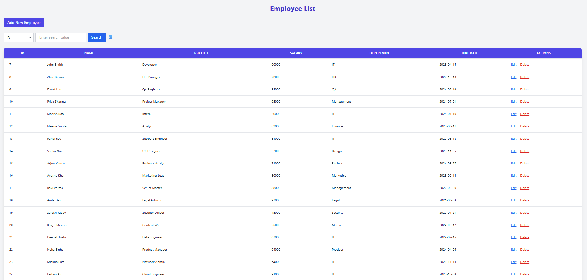

# 🌱 SpringEmployeeHub

Welcome to **SpringEmployeeHub**, a real-time Employee Management System built with **Spring Boot, Thymeleaf, and MySQL**. This project reflects my backend development journey, showcasing clean architecture, CRUD operations, and a responsive UI.

---

## 📸 Screenshots

### Employee List

### Add New Employee

### Home / Index Page

---

## 🧠 What I Learned

| 💡 Concept               | 💪 Hands-On Experience                           |
|--------------------------|--------------------------------------------------|
| **Spring Boot**          | Built a RESTful MVC backend                     |
| **JPA & Hibernate**      | Used repository pattern and entity relationships |
| **Thymeleaf**            | Implemented dynamic HTML templates               |
| **MySQL**                | Designed and connected a relational DB           |
| **Layered Architecture** | Followed Controller → Service → Repository flow   |
| **Debugging**            | Resolved issues with form binding and search     |
| **Tailwind CSS**         | Created clean, user-friendly layouts             |

---

## 🔧 Features

- 📋 List all employees in a styled table  
- ➕ Add employees with form validation  
- 🛠️ Update employee details  
- ❌ Delete with confirmation  
- 🔍 Search by ID, Name, Department, or Job Title  
- 🎨 Clean and responsive UI using Tailwind CSS

---

## 🛠️ Tech Stack

- `Java 17+`  
- `Spring Boot 3.x`  
- `Spring MVC`  
- `Spring Data JPA (Hibernate)`  
- `MySQL`  
- `Thymeleaf`  
- `Tailwind CSS`  
- `Git & GitHub`

---

## 📬 Contact

Let’s connect and build something impactful together!

- 📧 **Email**: [vikasiniias@gmail.com](mailto:vikasiniias@gmail.com)  
- 🔗 **LinkedIn**: [linkedin.com/in/vikasinim](https://www.linkedin.com/in/vikasinim)  
- 🐙 **GitHub**: [VikasiniM](https://github.com/VikasiniM)

🚀 Actively seeking **Internships** or **Full-Time** roles in **Backend** or **Full-Stack** Development.
